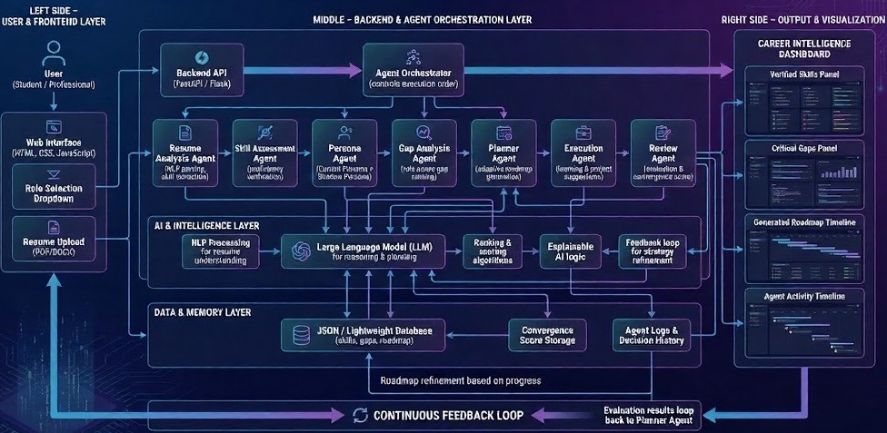
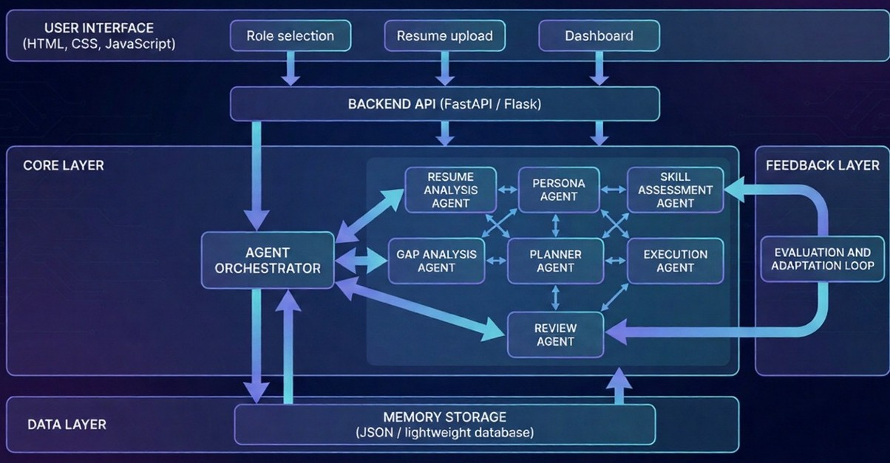

# 🌌 Shadow OS – Agentic AI Career Operating System


---

Welcome to **Shadow OS**, an **Agentic AI–powered career intelligence platform** that analyzes resumes, verifies skills, identifies critical gaps, and generates adaptive career roadmaps.

Designed as an **AI + Systems Engineering project**, Shadow OS treats career growth as a **continuously optimized system**, not static advice.

---

## 📜 Table of Contents
- [About the Project](#about-the-project)
- [Opportunity](#opportunity)
- [How Shadow OS Is Different](#how-shadow-os-is-different)
- [Features](#features)
- [AI Technologies Used](#ai-technologies-used)
- [System Architecture](#system-architecture)
- [Process Flow](#process-flow)
- [Project Structure & How to Run](#project-structure--how-to-run)
- [Ethical Considerations](#ethical-considerations)

---

## 🎯 About the Project

Shadow OS helps users move from their **current career state** to a **desired future role** using autonomous AI agents.

Key highlights:
- Resume-evidence-based skill verification
- Role-aware gap analysis
- Multi-phase adaptive roadmap generation
- Continuous evaluation through feedback loops

---

## 🚀 Opportunity

Most career platforms provide static suggestions and generic learning paths. Shadow OS addresses this gap by introducing **agentic intelligence** that actively reasons, plans, evaluates, and adapts career strategies over time.

---

## 🔍 How Shadow OS Is Different

| Traditional Platforms | Shadow OS |
|----------------------|-----------|
| Static recommendations | Continuous adaptive planning |
| Self-declared skills | Resume-evidence verification |
| Generic roadmaps | Role-aware roadmaps |
| No feedback loop | Convergence-based feedback |
| Manual tracking | Autonomous agents |

---

## ✨ Features
- Resume upload (PDF/DOCX)
- Target career role selection
- Intelligent skill extraction
- Skill proficiency verification
- Role-specific gap analysis
- Adaptive multi-phase roadmap
- Career convergence score
- Agent activity transparency
- Web-based dashboard visualization

---

## 🧠 AI Technologies Used
- Large Language Model (LLM) for reasoning & planning
- Multi-Agent architecture with orchestrator
- Natural Language Processing (resume analysis)
- Score-based skill evaluation
- Ranking & prioritization algorithms
- Explainable AI logic
- Feedback loop & adaptive planning
- Lightweight JSON-based memory

---

## 🏗 System Architecture


---

## 🔄 Process Flow



---

### 📁 Folder Description

- **Images/** – Contains UI screenshots and system architecture diagrams used in documentation and presentations.  
- **agents/** – Houses all AI agents responsible for resume parsing, skill assessment, gap analysis, planning, and evaluation.  
- **core/** – Shared utilities and core logic used across the system.  
- **data/** – Role definitions, skill mappings, and configuration data.  
- **memory/** – Stores runtime data such as verified skills, gaps, roadmaps, and convergence scores.  
- **ui/** – Web-based user interface built using HTML, CSS, and JavaScript.  
- **main.py** – Starts the application and initializes the system workflow.  
- **orchestrator.py** – Manages the execution sequence of all AI agents.  
- **server.py** – Handles backend API requests and frontend communication.  
- **requirements.txt** – Lists all required Python libraries.

---

### 🚀 Running the Project

1. Install the required dependencies:

```bash
pip install -r requirements.txt
```

2. Start the backend server:
```bash
python main.py
```

3. Open the user interface in a browser:
```bash
http://localhost:8000/ui/index.html
```

---

## ⚖ Ethical Considerations

- No automated job applications  
- No web scraping  
- No placement guarantees  
- No permanent user data storage  
- Decision-support system only  

---

## 🏁 Conclusion

Shadow OS demonstrates how **agentic AI systems** can be applied to real-world career development. By combining autonomous reasoning, adaptive planning, and explainable decisions, it moves beyond traditional recommendation engines and showcases intelligent career convergence.

---

⭐ **Thank you for exploring Shadow OS!**

